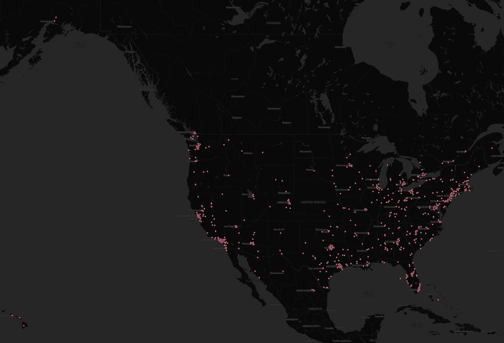

# Lab 2 Report

In this map, I set the search filters to be all the tweets about the key word "scenery" in the US and its territories to identify what are some of the places in the US with a reputable sceneries according to Tweeter users. The findings from getting all the tweets according to the criteria mentioned above were somewhat consistent with what the general belief was. There are many tweets happening in both of the coasts, which are some of the best palces in the US in terms of tourist attraction and natural and artificial sceneries. 
